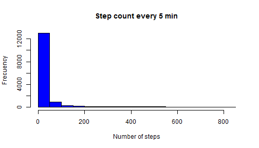
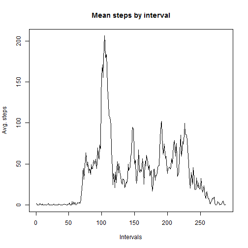
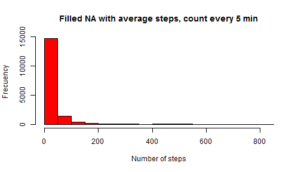
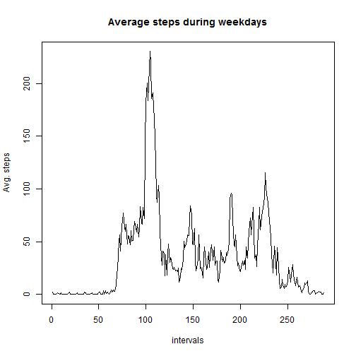
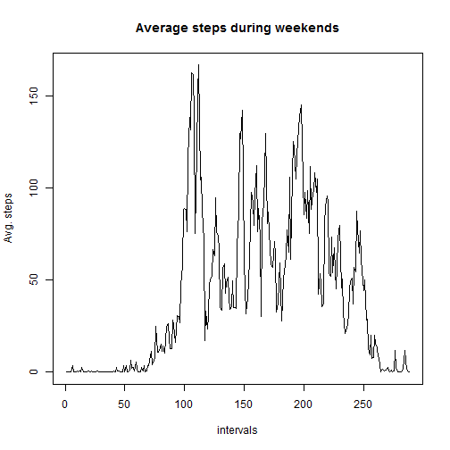

## Loading and preprocessing the data

```r
#Reading data .zip directly from the fork made from the PA template
if (!file.exists("./data/activity.csv")){
     unzip("activity.zip", exdir = "./data")
     }
steps <- read.csv("data//activity.csv", header = T, na.strings = "NA")

#Now transform treat dates as data type date
steps <- transform(steps, date = as.Date(date))
```

## What is mean total number of steps taken per day?
* Total step count

```r
sum(steps$steps, na.rm = TRUE)
```

```
## [1] 570608
```

* Histogram of steps count:

```r
hist(steps$steps, main="Step count every 5 min", 
     ylab="Frecuency", 
     xlab="Number of steps", 
     col="blue")
```

 

* Mean of steps

```r
mean(steps$steps, na.rm = TRUE)
```

```
## [1] 37.3826
```
* Median of steps

```r
median(steps$steps, na.rm = TRUE)
```

```
## [1] 0
```

## What is the average daily activity pattern?


* Average daily pattern

```r
summarized <- group_by(steps, interval) %>%
summarise(avgPerInterval = mean(steps, na.rm = TRUE))
plot.ts(summarized$avgPerInterval, main="Mean steps by interval", xlab="Intervals", ylab="Avg. steps")
```

 

* Maximum interval count is

```r
summarized[max(summarized$avgPerInterval),1]
```

```
## Source: local data frame [1 x 1]
## 
##   interval
## 1     1705
```

## Imputing missing values
* Total number of missing values (NA)

```r
sum(is.na(steps$steps))
```

```
## [1] 2304
```
* Filling in NA's, by using the mean number of steps in the interval

```r
     steps2 <- steps
     
     for(i in 1:nrow(steps2)) {
         if(is.na(steps2[i,1])) {
              steps2[i,1] <- summarized[summarized$interval == steps2[i,3],2]
         }
     }
```


* Histogram of filled NAs with average per interval

```r
     hist(steps2$steps, main="Filled NA with average steps, count every 5 min", 
          ylab="Frecuency", 
          xlab="Number of steps", 
          col="red")
```

 

* Mean and Median of filled NAs

```r
mean(steps2$steps)
```

```
## [1] 37.3826
```

```r
median(steps2$steps)
```

```
## [1] 0
```
** Comparing with previous numbers, I don't see significant changes with the filled in values. Further analysis may be needed.**

## Are there differences in activity patterns between weekdays and weekends?

```r
#split the values in weekdays and weekends. 3 step process to better deal with partial mutations
steps2 <- mutate(steps2, daytype=1)
steps2[!weekdays(steps2$date) %in% c("Saturday","Sunday"),4]="weekday"
steps2[steps2$daytype==1,4]="weekend"
steps2 <- mutate(steps2, daytype = as.factor(daytype))

summarized2 <- group_by(steps2, daytype, interval)
summarized2 <- summarise(summarized2, stepsavg=mean(steps))
```

Now showing the differences as a time series

```r
plot.ts(summarized2[summarized2$daytype=="weekday",3],
        main="Average steps during weekdays", ylab="Avg. steps", xlab="intervals")
```

 

```r
plot.ts(summarized2[summarized2$daytype=="weekend",3],
        main="Average steps during weekends", ylab="Avg. steps", xlab="intervals")
```

 
** There is certainly a difference between the steps given during the week and on weekends
